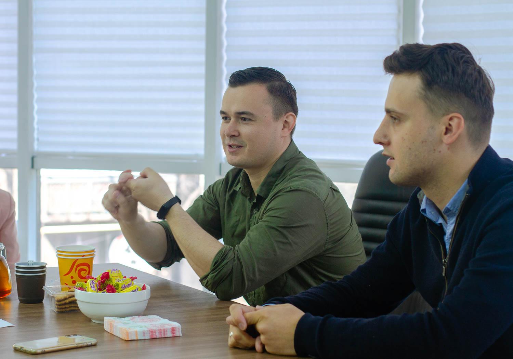

Для чего создавать еще одно Объединение которых в Казахстане насчитывается более десятка тысяч? Такой вопрос может возникнуть у любого человека, который неравнодушен к социальной сфере. Точно такой же вопрос стоял перед нами, когда мы с Романом обсуждали злободневные проблемы работы специалистов жестового языка.

